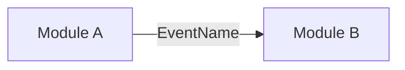

<!--
PR standard (English only). Keep every section that applies and delete the ones that do not.
Title: Conventional Commits, e.g. "feat(identity): open and close person sessions".
Diagrams: Mermaid, no colors or styles.
-->

## TL;DR

<!-- One or two sentences: what changes and why it matters. -->

**Ticket:** FAPI-<number>

## Description

<!-- What this PR does, technically. Main changes grouped by area. Link the Plane ticket. -->

## User story

<!-- Omit for pure tooling or infrastructure changes. -->

**As a** <role>,
**I want** <capability>,
**so that** <benefit>.

**Acceptance criteria**

- **Given** <context>, **when** <action>, **then** <outcome>.

## Architecture

<!-- Modules touched, public Api changes, events published or consumed, persistence changes (schemas, migrations, RLS). -->



## Proposed developer experience

<!-- How the change is used: endpoint calls, Api usage, commands to run, configuration. -->

```bash
# example
```

## Decisions made

| Decision | Why | Alternatives rejected |
| --- | --- | --- |
|  |  |  |

## Pending decisions

<!-- Open questions, follow-up tickets, known limitations. -->

- [ ] 

## Verification

<!-- Commands run and observed results. -->

- [ ] `./gradlew check` passes
- [ ] 
