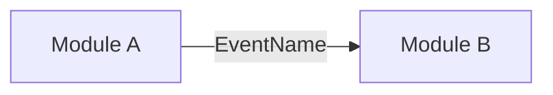

<!--
PR standard (English only). Keep every section that applies and delete the ones that do not.
Title: Conventional Commits, e.g. "feat(identity): open and close person sessions".
Diagrams: Mermaid, no colors or styles.
-->

## TL;DR

<!-- One or two sentences: what changes and why it matters. -->

**Ticket:** [FAPI-<number>](https://app.plane.so/nulled-software/browse/FAPI-<number>/)

## Description

<!-- What this PR does, technically. Main changes grouped by area. Link the Plane ticket. -->

## User story

<!-- Omit for pure tooling or infrastructure changes. -->

**As a** <role>,
**I want** <capability>,
**so that** <benefit>.

**Acceptance criteria**

- **Given** <context>, **when** <action>, **then** <outcome>.

## Architecture

<!-- Modules touched, public Api changes, events published or consumed, persistence changes (schemas, migrations, RLS). -->



## Observability

<!-- Required: every metric and span this change adds or changes. Write "None: <reason>" only when nothing is exposed. Tags list their allowed values (low cardinality only; never tenant, user or entity ids). -->

| Metric | Type | Unit | Tags (allowed values) | Kind | What it answers |
| --- | --- | --- | --- | --- | --- |
| `frappe.<module>.<noun>.<past-participle>` | counter / distribution / timer / gauge | items / seconds / bytes / money | `outcome` (`success`, `failure`) | business / infrastructure |  |

| Span / observation | Kind | Key attributes | When |
| --- | --- | --- | --- |
|  | internal / server / producer / consumer |  |  |

## Events

<!-- Required: every domain event this change publishes or consumes. Write "None: <reason>" only when there are none. Payloads carry ids, never secrets or personal data beyond what consumers need. -->

| Event | Version | Published by | Consumed by | NATS subject | Externalized | Payload (field: type) | Idempotency | Description |
| --- | --- | --- | --- | --- | --- | --- | --- | --- |
| `PersonRegistered` | 1 | identity | notification | `frappe.identity.person-registered.v1` | yes | `eventId: UUID`, `personId: UUID`, `occurredAt: Instant` | `eventId` |  |

## Proposed developer experience

<!-- How the change is used: endpoint calls, Api usage, commands to run, configuration. -->

```bash
# example
```

## Decisions made

| Decision | Why | Alternatives rejected |
| --- | --- | --- |
|  |  |  |

## Pending decisions

<!-- Open questions, follow-up tickets, known limitations. -->

- [ ] 

## Verification

<!-- Commands run and observed results. -->

- [ ] `./gradlew check` passes
- [ ] Manual calls against the running app (`trying-endpoints.md`), one line each: `METHOD path → status, code`; or "Not applicable: no route changes"
- [ ] Docs and skills updated (skill references, `keeping-docs-in-sync.md`) or not applicable
- [ ] 
