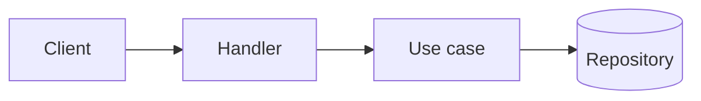

<!--
  BEFORE SUBMITTING
  - Remove ANY AI attribution from this PR: "Generated with ...", "Co-Authored-By: <AI>",
    bot signatures or footers added by AI tools. Check commits too.
  - No emojis or decorative symbols anywhere (title, description, commits, diagrams).
    Plain ASCII text only.
  - Branch name MUST follow: <type>/<short-description>
      Types: feat | fix | refactor | perf | test | docs | build | ci | chore | revert | style
      Example: feat/cancel-pending-orders
  - PR title MUST follow Conventional Commits:
      <type>(<optional scope>)!: <short imperative summary>
    Types: feat | fix | refactor | perf | test | docs | build | ci | chore | revert | style
    Examples:
      feat(orders): add endpoint to cancel pending orders
      fix(auth)!: reject expired refresh tokens
  - Sections marked (optional) must be DELETED when they do not apply. Do not leave them empty.
-->

## TL;DR

<!-- One or two sentences: what changes and why it matters. -->

## How to read this PR

<!-- Suggested reading order for reviewers. Point to the files that matter first. -->

- [ ] Start with `path/to/entrypoint.go` - ...
- [ ] Then `path/to/core_logic.go` - ...
- [ ] Tests in `path/to/..._test.go` - ...

## Related

<!-- Tickets, issues, docs, previous PRs. -->

- Closes #

## Technical description

<!-- What was done and how. Architecture, layers touched, data flow, relevant trade-offs. -->

## Architecture (optional)

<!--
  Components, layers and boundaries touched by this PR (e.g. domain, application,
  ports, adapters). Explain how the change fits into the existing architecture.
-->

## Diagrams (optional)

<!--
  Add as many Mermaid diagrams as needed. Pick whichever type best explains the change:
    flowchart          - control flow, decision logic
    sequenceDiagram    - request/response, service interactions, event flow
    classDiagram       - types, interfaces, dependencies
    stateDiagram-v2    - state machines, lifecycles
    erDiagram          - data model, schema changes
    C4Context / C4Container / C4Component - system architecture
    architecture-beta  - infrastructure and services
    block-beta         - high-level component layout
    gitGraph           - branching / release strategy
    timeline, gantt    - rollout plans, migrations
    mindmap            - scope overview
    packet-beta, xychart-beta, sankey-beta, quadrantChart, requirementDiagram, journey
  Rules:
    - Keep diagrams colorless: no `style`, `classDef`, `linkStyle` or theme overrides.
    - One diagram per concern. Give each a short heading.
    - Avoid syntax errors (GitHub shows "Unable to render rich display"):
      - Sequence messages: no `;` (it ends the statement) and no `#`. Write
        "one transaction: order and outbox row", not "BEGIN; insert; COMMIT".
      - Flowchart labels with symbols or spaces: quote them, A["GET /v1/orders/{id}"].
        Unquoted (), [], {}, <, >, | and " break the parser.
      - Node ids: letters and digits only (no spaces, dots or dashes).
      - `end` is a keyword; do not use it as a node id.
    - Preview before submitting: https://mermaid.live (or GitHub's Preview tab).
-->

### <diagram title>



## Use cases (optional)

<!-- One block per use case. Use the user story + Gherkin scenarios format. -->

### UC-1: <name>

**As a** <actor>, **I want** <capability>, **so that** <benefit>.

```gherkin
Scenario: <happy path>
  Given <initial context>
  When <action>
  Then <expected outcome>

Scenario: <edge case / failure>
  Given <initial context>
  When <action>
  Then <expected outcome>
```

## HTTP routes (optional)

| Method | Path | Auth | Description |
| ------ | ---- | ---- | ----------- |
| `GET`  | `/v1/...` | ... | ... |

### Requests (optional)

<details>
<summary><code>METHOD /v1/...</code></summary>

```json
{}
```

</details>

### Responses (optional)

<details>
<summary><code>200 OK</code> - METHOD /v1/...</summary>

```json
{}
```

</details>

<details>
<summary><code>4xx / 5xx</code> - METHOD /v1/...</summary>

```json
{}
```

</details>

## Events emitted (optional)

| Event | Topic / Channel | Trigger | Payload |
| ----- | --------------- | ------- | ------- |
| `...` | `...` | ... | see below |

<details>
<summary>Payload example</summary>

```json
{}
```

</details>

## Events subscribed (optional)

| Event | Topic / Channel | Handler | Idempotent | Retry / DLQ |
| ----- | --------------- | ------- | ---------- | ----------- |
| `...` | `...` | `...` | yes / no | ... |

## Metrics exposed (optional)

| Name | Type | Labels | Description |
| ---- | ---- | ------ | ----------- |
| `...` | counter / gauge / histogram | `...` | ... |

## Jobs exposed (optional)

| Job | Schedule / Trigger | Idempotent | Timeout | Description |
| --- | ------------------ | ---------- | ------- | ----------- |
| `...` | `cron` / manual / event | yes / no | ... | ... |

## Data changes (optional)

<!-- Migrations, schema changes, backfills. State whether they are reversible. -->

- Migration: `...`
- Reversible: yes / no
- Backfill required: yes / no

## Configuration (optional)

<!-- New or changed env vars, feature flags, secrets (names only, NEVER values). -->

| Variable / Flag | Required | Default | Description |
| --------------- | -------- | ------- | ----------- |
| `...` | yes / no | `...` | ... |

## Technical decisions

<!-- Decisions taken in this PR and WHY. Include discarded alternatives. -->

| Decision | Why | Alternatives discarded |
| -------- | --- | ---------------------- |
| ... | ... | ... |

## Pending technical decisions (optional)

<!-- Open questions or deferred work. Link follow-up issues. -->

- [ ] ...

## Breaking changes (optional)

<!-- What breaks, who is affected and the migration path. Title must include "!". -->

## Security considerations (optional)

<!-- AuthN/AuthZ, input validation, sensitive data, new dependencies. -->

## Observability (optional)

<!-- Logs, traces, dashboards, alerts added or changed. -->

## Rollout & rollback (optional)

<!-- Deploy order, feature flags, how to revert safely. -->

## Testing

<!-- How this was verified. -->

- [ ] Unit tests
- [ ] Integration tests
- [ ] Manual verification: ...

## Checklist

- [ ] PR title follows Conventional Commits
- [ ] No AI attribution in PR description or commits
- [ ] No emojis or decorative symbols
- [ ] Tests added or updated
- [ ] Docs updated (if applicable)
- [ ] Non-applicable optional sections removed

<!--
  FINAL CHECK: remove ANY AI attribution before submitting
  ("Generated with ...", "Co-Authored-By: <AI>", bot footers or signatures).
-->
