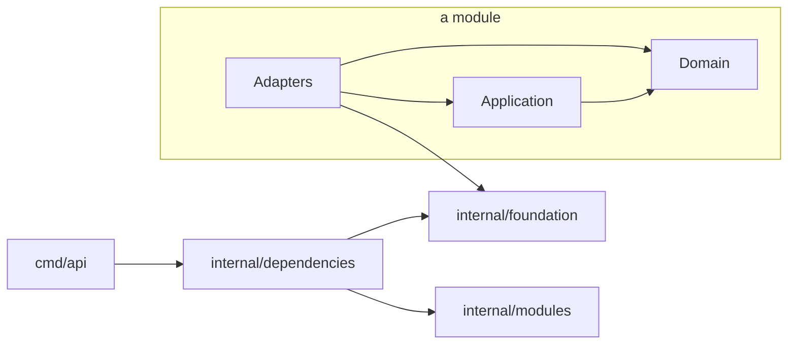

# Frappé API

Backend API of the frappe platform for restaurants, cafes and food businesses across LATAM. Go, hexagonal architecture, Postgres with Row Level Security, and OpenTelemetry from day one.

> Proprietary software of Nülled Software. See [LICENSE](LICENSE). No use, copy or distribution without written permission.

## Quick start

Requirements: Go (version in `go.mod`), [Task](https://taskfile.dev), Docker (Docker Desktop, OrbStack or Colima).

```bash
cp .env.example .env   # local defaults, loaded by every task
task local:up          # services, migrations and the API with hot reload
```

`task local:up` starts Postgres, Valkey, NATS and Grafana LGTM, waits until they are healthy, applies migrations and runs the API on http://localhost:8080 with hot reload (air). Saving a `.go` or `.sql` file rebuilds and restarts it gracefully.

Verify:

```bash
curl -i http://localhost:8080/health/ready   # 200 application/health+json
open http://localhost:8080/docs               # OpenAPI docs (development only)
open http://localhost:3000                    # Grafana: logs, traces, metrics
```

Stop:

| Action | Effect |
|--------|--------|
| Ctrl+C | Stops the API; services keep running for a fast next start |
| `task local:down` | Stops every service, keeps data |
| `task local:reset` | Stops every service and deletes local data (asks first) |

## Everyday commands

Tasks follow `<domain>:<action>`. Run `task` to list them all.

| Goal | Command |
|------|---------|
| Everything local, hot reload | `task local:up` / `task local:down` |
| API only, hot reload | `task application:watch` |
| API only, no reload | `task application:run` |
| Run with Infisical secrets | `task secrets:run` |
| Full local check (same as CI) | `task ci:run` |
| Unit tests | `task test:unit` |
| Integration tests (Docker) | `task test:integration` |
| Lint / auto-fix | `task lint:run` / `task lint:fix` |
| Architecture rules | `task architecture:check` |
| New migration | `task migrations:create -- <name>` |
| Migration status / rollback | `task migrations:status` / `task migrations:rollback` |
| Vulnerability scan | `task security:vuln` |

## Architecture

Screaming, hexagonal architecture. Infrastructure and business never share a root.

```
cmd/
  api/                  API entrypoint
  migrate/              migration runner (separate binary, same image)
internal/
  foundation/           what makes the application run, zero business
    application/        lifecycle: hooks, Up/Down, readiness
    cache/              read-through cache: Store port, memory and valkey adapters, event invalidation
    configuration/      configuration and validation (environment provider)
    database/           pgx pool, RLS-ready transactions
    events/             broker-agnostic events: CloudEvents envelope, ports, typed consumers
      outbox/           storage-agnostic transactional outbox and relay
        postgres/       Postgres outbox store (LISTEN/NOTIFY wake-ups)
      memory/           in-memory broker (tests, running without a broker)
    health/             background dependency checks
    jobs/               background and periodic jobs: typed definitions, Enqueuer port, telemetry
      river/            River (Postgres) backend: workers, periodic leader, depth and leader gauges
      jobstest/         Recorder and Run test doubles; queuetest/ is the backend contract suite
    httpserver/         HTTP server, middleware, Huma /v1 API
    logging/            JSON logs to stdout, level gating
    nats/               NATS JetStream event broker adapter
    ratelimit/          GCRA rate limiter on Valkey
    telemetry/          OpenTelemetry traces, metrics, logs
    valkey/             Valkey client
  modules/              business modules (one folder per module)
    <module>/
      domain/           entities and rules, no infrastructure
      application/      use cases and the ports they need
      adapters/         http, postgres, ...
      events/           published events: the only package other modules may import
      metrics/          module metrics
      tracing/          module spans
      module.go         module wiring
  dependencies/         composition root: builds dependencies, injects modules
migrations/             SQL migrations (goose, timestamp-versioned, embedded)
deployments/            local infrastructure (database init script)
```



Rules enforced in CI by `go-arch-lint` and `depguard`:

- `domain` imports nothing from infrastructure (no HTTP, database, JSON or OpenTelemetry).
- `application` depends only on its own `domain`; it never touches the database or `pgx`.
- `foundation` never imports `modules` or `dependencies`.
- A module never imports another module's internals; `modules/<module>/events` is the only package other modules' application, adapters and module root may import, and it depends on `foundation/events` only. `domain` never imports events.
- Only `foundation/nats` and `dependencies` may import the NATS client; everything else uses the broker-agnostic ports.
- Modules never read the global configuration: each module declares its own `Configuration` and `Dependencies` and receives them by constructor.

## Key concepts

| Concept | How it works |
|---------|--------------|
| Lifecycle | Every dependency declares `Up`, `Down` and optionally `Check`. Up runs in order, Down in reverse, failures roll back what already started. |
| Readiness | `/health/live` never checks dependencies. `/health/ready` is 503 until every `Up` finished and every declared check passes; it flips to 503 first on shutdown, then the server drains. |
| Row Level Security | Tenant settings are applied per transaction with `set_config(..., true)`, never per session. The application role cannot bypass RLS; tables use `FORCE ROW LEVEL SECURITY`. |
| Database roles | `frappe_migration` owns the schema and runs migrations; `frappe_application` is the runtime role (RLS-bound; on `outbox` it may only `INSERT`; on `inbox` only `INSERT`, `DELETE` and `SELECT (processed_at)`); `frappe_outbox_relay` is the outbox relay's role (`SELECT`, `UPDATE`, `DELETE` on `outbox` only, across tenants). All three are created outside migrations (`deployments/database/initialize.sql` locally). |
| Migrations | Run by `cmd/migrate` as a deploy step, never at API startup. Timestamp-versioned, out-of-order allowed. |
| Cache | Infrastructure only: a module adapter decorates its read port with `cache.New(backend, "<module>.<entry>", lifetime, next.Find)` and calls `Get`; use cases and domain never see it. Keys are `frappe:<tenant:<id>|global>:<name>:v<version>:<key>`, tenant from context (no tenant, no caching), escaped keys, singleflight, fails open, no negative caching, jitter, event-driven invalidation. See `internal/foundation/cache/doc.go`. |
| Rate limiting | GCRA in Valkey, IETF `RateLimit-*` headers, 429 as RFC 9457. Fails open if Valkey is unavailable. |
| Internationalization | `I18N_SUPPORTED_LOCALES` (default `es-419,en,pt-BR,fr,it,de,ru,zh-Hans,ko,ja`) and `I18N_SOURCE_LOCALE` (default `es-419`) are BCP 47 tags validated at startup; each needs an embedded catalog. Every `/v1` request negotiates `Accept-Language` (es-AR matches es-419, pt matches pt-BR, no match falls back to the source) and gets `Content-Language` and `Vary: Accept-Language`. Static messages live in `internal/foundation/i18n/locales/<tag>.json`; translate with `i18n.T(ctx, "key")` or `i18n.TranslateWith(ctx, "key", i18n.Data{"Count": n})`, falling back requested locale, source, key. A test fails when a catalog misses a source key. See `internal/foundation/i18n/doc.go`. |
| CORS | Disabled unless `HTTP_CORS_ALLOWED_ORIGINS` lists exact origins. Preflights are answered with 204 before rate limiting and routing; `*` with credentials is rejected at startup. |
| Event broker | `EVENTS_BROKER` selects `none` (default), `memory` (single process) or `nats` (JetStream stream `FRAPPE_EVENTS`, dedup on event ID, durable pull consumers, dead letters in `FRAPPE_EVENTS_DEAD_LETTER`). Only `internal/foundation/nats` and `internal/dependencies` may import the NATS client. |
| HTTP caching | Every `/v1` response is `Cache-Control: no-store` unless the handler declares a policy (`httpserver.Private`, `Revalidate`, `Public`, `NoStore`) with an ETag through `httpserver.NotModified`, which answers matching `If-None-Match` GET/HEAD requests with 304 before the body is computed. Private and Revalidate add `Vary: Authorization`; Public is only for non-tenant data. See `internal/foundation/httpserver/doc.go`. |
| Errors | RFC 9457 `application/problem+json`. |
| Events | CloudEvents 1.0 JSON, type `frappe.<module>.<event>.v<version>`, defined with `events.Define`. Use cases `Record` into a transactional outbox (storage-agnostic `outbox.Store`); a relay publishes to any broker behind `events.Publisher`. Delivery is at-least-once; the consumer runtime deduplicates every handler registered with `events.On` through the inbox, so handlers are exactly-once in effect. Failures retry with backoff, then dead letter. `partitionkey` and `sequence` extensions order events per entity. See `internal/foundation/events/doc.go`. |
| Jobs | Background and periodic jobs on Postgres (River) behind `foundation/jobs`; modules never import River. The composition root creates one `jobs.Catalog` and hands `catalog.Module("<module>")` to each module (like `registry.Module` for events). A module defines private jobs on it with `jobs.Define[Args]`, named `<module>.<action_snake_case>` (validated and unique at startup), handles them with `jobs.Handle(module, definition, handler)` and enqueues with `Definition.Enqueue(ctx, args, jobs.After, jobs.Queue, jobs.Unique)`. Enqueue joins the transaction in ctx, so a rolled back unit of work drops its jobs. `jobs.Unique(0)` deduplicates against unfinished jobs only. `jobs.Every` and `jobs.Cron` run once per tick across replicas (elected leader). Handlers are idempotent, take IDs as arguments and may return `jobs.Cancel` or `jobs.Snooze`. The tenant and trace context of the enqueuer are restored for the handler. See `internal/foundation/jobs/doc.go`. |
| Telemetry | OTLP to any collector (local otel-lgtm or Grafana Cloud). Parent-based trace sampling: 100% in development, 10% in production. |

## Configuration

All configuration comes from environment variables, validated at startup: invalid or missing values stop the application with a message naming the variable. [`.env.example`](.env.example) lists every variable with its default.

Secrets are never committed. Locally, `task secrets:run` injects them with the Infisical CLI; in deployed environments the orchestrator injects them as environment variables.

### Events: define, record, relay, consume

1. **Define** an event in the module's published `events` package: `var OrderPlaced = events.Define[OrderPlacedData]("orders.placed", 1)` (type `frappe.orders.placed.v1`).
2. **Record** it in the use case, inside the transaction that changes state: `recorder.Record(ctx, OrderPlaced.With(data))` within `database.WithinTransaction`. The event lands in the `outbox` table if and only if the business change commits (`Append` fails outside a transaction), and carries the caller's trace context.
3. **Relay.** With `OUTBOX_ENABLED=true`, the relay claims pending rows with `FOR UPDATE SKIP LOCKED` (safe on many replicas), publishes them to the broker selected by `EVENTS_BROKER` (wired automatically; `OUTBOX_ENABLED` with `EVENTS_BROKER=none` is a configuration error) and marks them published. It is woken by `LISTEN outbox`, with polling as a fallback. Leases and retry times use the database clock. A crash between publish and mark republishes the event with the same ID.
4. **Consume.** A module registers handlers in its `Subscriptions(registry)` with `events.On(registry.Module("billing"), orders.OrderPlaced, handler)`; the composition root builds the registry. When `EVENTS_BROKER` is not `none`, the consumer runtime subscribes every registration at startup and stops them (waiting for in-flight handlers) at shutdown.
5. **Inbox.** Each delivery runs through `inbox.Store.Process(consumer, event ID)`: one transaction inserts `(consumer, event_id)` into `inbox` with `ON CONFLICT DO NOTHING` and runs the handler with a ctx carrying that transaction, so the handler's writes (through `database.WithinTransaction`, nested with tenant settings when needed, or `database.TransactionFromContext`) commit atomically with the record. An already recorded event is skipped and counted in `frappe.events.duplicates{consumer,type}`; a failed handler records nothing and is retried. Records older than `INBOX_RETENTION` are purged by the runtime.

Neither `outbox` nor `inbox` has RLS: they hold no data readable through the API, and privileges isolate them instead (`frappe_application` may only `INSERT` into `outbox`; on `inbox` it may `INSERT`, `DELETE` and read `processed_at` for the purge, never which events were processed).

Locally, `compose.yaml` runs the whole flow: `EVENTS_BROKER=nats`, `OUTBOX_ENABLED=true` and `DATABASE_OUTBOX_RELAY_URL` for the development `frappe_outbox_relay` role. The end-to-end proof is `TestIntegrationEventFlowIsAtomicTracedAndExactlyOnce` in `internal/dependencies`.

| Variable | Default | Meaning |
|----------|---------|---------|
| `EVENTS_BROKER` | `none` | `none`, `memory` or `nats`. Anything but `none` also runs the consumer runtime. |
| `OUTBOX_ENABLED` | `false` | Runs the relay. Requires `EVENTS_BROKER` other than `none` and `DATABASE_OUTBOX_RELAY_URL`. Recorded events are kept while it is off. |
| `DATABASE_OUTBOX_RELAY_URL` | | Connection string for `frappe_outbox_relay`. Secret. |
| `OUTBOX_BATCH_SIZE` | `100` | Messages claimed at once. |
| `OUTBOX_POLL_INTERVAL` | `1s` | Poll when no notification arrives. |
| `OUTBOX_LEASE` | `30s` | Claim lease; must exceed the time to publish a batch. |
| `OUTBOX_PURGE_INTERVAL` / `OUTBOX_RETENTION` | `1h` / `72h` | How often and after how long published rows are deleted. |
| `OUTBOX_BASE_BACKOFF` / `OUTBOX_MAX_BACKOFF` | `1s` / `5m` | Exponential retry delay bounds. |
| `INBOX_PURGE_INTERVAL` / `INBOX_RETENTION` | `1h` / `168h` | How often and after how long inbox records are deleted. Retention must outlive every redelivery (it matches `NATS_STREAM_MAX_AGE`), or a late duplicate is handled again. |

### Jobs: define, enqueue, handle, schedule

```go
// Composition root: one catalog, one module scope per module.
jobCatalog := jobs.NewCatalog()
menu.Wire(menu.Dependencies{Jobs: jobCatalog.Module("menu") /* ... */})

// Module (private to it): define, handle and schedule at wiring time.
type RebuildIndexArgs struct {
    MenuID uuid.UUID `json:"menuId"`
}

rebuildIndex := jobs.Define[RebuildIndexArgs](dependencies.Jobs, "rebuild_index", jobs.WithMaxAttempts(5))
jobs.Handle(dependencies.Jobs, rebuildIndex, func(ctx context.Context, job jobs.Job[RebuildIndexArgs]) error {
    return useCase.Execute(ctx, job.Args.MenuID)
})
jobs.Cron(rebuildIndex, "0 3 * * *", RebuildIndexArgs{})

// Use case, given rebuildIndex: inside a unit of work it is inserted only if it commits.
_, err := rebuildIndex.Enqueue(ctx, RebuildIndexArgs{MenuID: id}, jobs.After(time.Minute), jobs.Unique(0))
```

The schema is `migrations/20260926000000_river.sql`, generated with `river migrate-get` so goose stays the only migration tool; a River release with a new schema version gets a new goose migration generated the same way. Tests build definitions on `jobstest.NewCatalog()`, which returns an isolated catalog and the `Recorder` its enqueues go to (`jobstest.Enqueued`), and use `jobstest.Run` to execute a handler synchronously; backends prove themselves with `queuetest.Run`.

Telemetry: a producer span `<name> enqueue` and a consumer span `<name> process` linked to it (trace context travels in the job metadata); metrics `frappe.jobs.enqueued`, `frappe.jobs.handled` and `frappe.jobs.handle.duration` (by `name`, `queue`, `outcome`), `frappe.jobs.attempts`, `frappe.jobs.lag`, `frappe.jobs.queue.depth` (by `queue`, `state`, reported by the leader only), `frappe.jobs.periodic.ticks` and `frappe.jobs.leader` (no attributes; replicas differ by resource); one log line per attempt with `job_id`, `job_name`, `job_attempt` and `tenant`.

| Variable | Default | Purpose |
|---|---|---|
| `JOBS_ENABLED` | `true` | Works jobs on this replica and joins the periodic leader election. Disabled replicas still enqueue. |
| `JOBS_WORKERS` | `10` | Concurrent attempts per queue. |
| `JOBS_MAX_ATTEMPTS` | `25` | Attempts of a job whose definition sets none. |
| `JOBS_JOB_TIMEOUT` | `1m` | Attempt timeout of a job whose definition sets none. |
| `JOBS_FETCH_POLL_INTERVAL` | `1s` | Poll when no notification arrives. |
| `JOBS_COMPLETED_RETENTION` | `24h` | How long completed jobs are kept. |
| `JOBS_METRICS_INTERVAL` | `15s` | How often queue depth and leadership are sampled. |

### Cache: decorate a read port

```go
// adapters: the use case keeps depending on application.Menus
type CachedMenus struct {
    application.Menus
    byID *cache.ReadThrough[uuid.UUID, domain.Menu]
}

func NewCachedMenus(backend *cache.Backend, next application.Menus) *CachedMenus {
    return &CachedMenus{Menus: next, byID: cache.New(backend, "menu.by_id", 5*time.Minute, next.FindByID)}
}

func (menus *CachedMenus) FindByID(ctx context.Context, id uuid.UUID) (domain.Menu, error) {
    return menus.byID.Get(ctx, id)
}

// module root: drop entries when menu.updated is consumed
eventinvalidation.On(registry, menuevents.Updated, byID,
    func(event events.Event[menuevents.MenuUpdated]) (string, []uuid.UUID) {
        return event.Data.Tenant, []uuid.UUID{event.Data.MenuID}
    })
```

Options: `cache.Global()` (not tenant-owned), `cache.Version(n)` (bump when the cached type changes; old entries are orphaned), `cache.Codec(c)`, `cache.Jitter(fraction)`. `InvalidateFor(ctx, tenant, keys...)` is the only explicit-tenant call, for event consumers. Metrics: `frappe.cache.requests{module,outcome}`, `frappe.cache.load.duration{module}`, `frappe.cache.errors{operation,reason}`.

| Variable | Default | Meaning |
| --- | --- | --- |
| `CACHE_ENABLED` | `false` | Off: every entry loads from the source. |
| `CACHE_STORE` | `memory` | `memory` or `valkey` (shares the rate limiter's client; requires `VALKEY_ADDRESS`). |
| `CACHE_DEFAULT_TIME_TO_LIVE` | `5m` | Lifetime of entries created with a zero lifetime. |
| `CACHE_OPERATION_TIMEOUT` | `100ms` | Max latency an unhealthy store adds before a read fails open. |

### Localized texts: translatable user data

User-entered strings that need translations (a dish description) never get a per-entity translation table. The entity holds `<field>_text_id uuid REFERENCES localized_texts (id)`, and `internal/foundation/i18n/localizedtext` manages the text:

- `localized_texts` holds the source value, locale, SHA-256 `source_hash` and an optional machine translation `context`; `localized_text_translations` holds one row per locale with `origin` (`manual`/`machine`), `status` (`current`/`stale`/`pending`/`failed`) and the `source_hash` it was made for. `locales` lists the supported locales (a new locale needs a migration).
- Changing a source marks older translations stale. Manual ones stay manual and are only flagged; machine ones are requested again. A machine translation never overwrites a manual one and is discarded if the source changed meanwhile.
- Reads resolve the locale through the catalog and fall back to the source. `LocalizeMany` loads a whole list in one query.
- RLS: `tenant_id` comes from the transaction's `application.tenant`. Global texts (`tenant_id` NULL) are readable by every tenant and written only by `frappe_migration`.
- `TranslationRequester` is the "translation needed" port, implemented by machine translation (below). Requests are recorded as pending rows (`requested_at`, `attempts`), which is what deduplicates them; a pending row older than `PendingTimeout` (default 15m) is requested again, on read or by the expired sweep.
- Reads request translations best effort, in a savepoint: a failure is logged, counted (`frappe.localizedtext.request.failures`) and added to the span, and the read still succeeds. Recording pending rows needs a writable transaction.
- `UpdateSource` keeps the stored context unless `Source.Context` is set or `ClearContext` is true. Global texts return `ErrReadOnlyText` on writes.
- At startup the API fails if a supported locale is missing from `locales`.
- Referencing foreign keys must be `ON DELETE NO ACTION` or `RESTRICT`, and each one must be declared as a `Field`. The orphan sweep reads them from `pg_constraint` and refuses to run on any mismatch.

```go
var dishDescription = localizedtext.Field{
    Table: "dishes", Column: "description_text_id",
    Context: "Description of a dish on a restaurant menu", // used when the text has no context
}
descriptions, err := localizedTexts.Field(dishDescription) // at wiring time

// in the use case's transaction
textID, err := descriptions.Create(ctx, localizedtext.Source{Value: command.Description})
localized, err := descriptions.LocalizeMany(ctx, ids, locale) // map[ID]Localized{Value, Locale, Fallback, Origin, Status}
err = descriptions.Delete(ctx, textID)                         // with the dish, same transaction
```

`Service.DeleteOrphans(ctx, olderThan, limit)` removes texts no declared field references (per tenant transaction, `SKIP LOCKED`); the `localized_texts.delete_orphan_texts` job runs it periodically.

#### Machine translation (DeepL)

`internal/foundation/i18n/machinetranslation` holds the `Translator` port and the River jobs (module `localized_texts`); `machinetranslation/deepl` is the adapter. DeepL is never called inside an HTTP request:

1. A write or read that needs a translation records a pending row and, in the same transaction, enqueues `localized_texts.machine_translate` with the text IDs and source hashes, one job per locale, context and batch (`DEEPL_BATCH_SIZE`). The job carries the transaction's `application.tenant` (`jobs.Tenancy`). The pending row is the deduplication: a pending translation is not requested again until its request expires.
2. The job loads the texts in a transaction for that tenant, skips texts that were deleted, changed since the request, translated manually or are already current, and leases the rest: their `requested_at` moves past the current attempt, and past every snooze or retry, so neither reads nor the expired sweep request a text a live job still works on (no duplicate billing).
3. It calls DeepL outside any transaction, one request per source locale and context (the text's own, else the field default), split so the JSON encoded texts and context stay under 100 KiB (DeepL's limit is 128 KiB). It stores each result with `SetMachineTranslation`, which discards it if the source changed meanwhile or a manual translation exists.
4. `429`/`529` snooze the job for `Retry-After`. `456` (quota) and `401`/`403` (key) pause all machine translation of the process for `DEEPL_QUOTA_PAUSE` (logged and counted once per pause, not per call) and snooze the jobs until then. `413` splits the batch; a single text still too large, or one DeepL rejects (other `4xx`), is marked `failed`. `5xx` and network errors retry with backoff (5 attempts).
5. `localized_texts.request_expired_translations` requests lost pending translations again, and `localized_texts.delete_orphan_texts` deletes unreferenced texts, once per tenant. A translation requested `LOCALIZED_TEXTS_MAX_REQUEST_ATTEMPTS` times is marked `failed` instead. A `failed` translation is not requested again until its source changes. Tenants come from `localized_text_tenants()`, a `SECURITY DEFINER` function over a tenant directory that a trigger fills as texts are created; it returns tenant identifiers only, so the application role can list tenant identifiers and nothing else about other tenants (no tenant model exists yet).

Global texts (`tenant_id` NULL) are never machine translated: they are not marked pending, and a job without a tenant is cancelled. Without `DEEPL_API_KEY` machine translation is disabled at startup (logged): nothing is requested or marked pending, reads fall back to the source, queued translation jobs are cancelled, and the orphan sweep still runs.

DeepL codes come from an allowlist: `en` is `EN-GB` or `EN-US` when the tag says so, else `DEEPL_ENGLISH_VARIANT`; `pt` is `PT-BR` or `PT-PT`; `es` is `ES-419` or `ES`; `zh` is `ZH-HANT` for Traditional Chinese, else `ZH-HANS`; everything else is the language (`fr-CA` is `FR`). The source language is sent as the language only (`ES`). The context is sent as DeepL `context`, which is not translated and not billed.

Metrics: `frappe.deepl.characters.sent` (by `target`, `outcome`: only `success` is billed) and `frappe.deepl.characters.billed` (by `target`), `frappe.deepl.requests` (by `target`, `outcome`), `frappe.deepl.request.duration`, `frappe.machinetranslation.translations` (by `outcome`: `stored`, `discarded_source_changed`, `skipped_*`, `failed_*`), `frappe.machinetranslation.failures` (by `kind`), `frappe.machinetranslation.circuit.transitions` (by `state`, `reason`) and `frappe.machinetranslation.swept` (by `sweep`). Spans: `machinetranslation translate` around each DeepL call, plus the otelhttp client span. The API key never appears in logs, errors or spans.

| Variable | Default | Meaning |
| --- | --- | --- |
| `DEEPL_API_KEY` | empty | Secret. Empty disables machine translation. |
| `DEEPL_BASE_URL` | from the key | Keys ending in `:fx` use `https://api-free.deepl.com`, others `https://api.deepl.com`. |
| `DEEPL_ENGLISH_VARIANT` | `EN-US` | `EN-US` or `EN-GB`. |
| `DEEPL_FORMALITY` | empty | Empty, `prefer_more` or `prefer_less` (falls back to the default where a language has no formality). |
| `DEEPL_TIMEOUT` | `30s` | Bound on one DeepL request. |
| `DEEPL_BATCH_SIZE` | `50` | Texts per job and request (1 to 50); requests are also split by size. |
| `DEEPL_QUOTA_PAUSE` | `1h` | How long machine translation pauses after an exhausted quota or rejected key. |
| `LOCALIZED_TEXTS_EXPIRED_SWEEP_INTERVAL` | `5m` | How often lost translation requests are requested again. |
| `LOCALIZED_TEXTS_ORPHAN_SWEEP_INTERVAL` | `1h` | How often unreferenced texts are deleted. |
| `LOCALIZED_TEXTS_ORPHAN_MINIMUM_AGE` | `24h` | How long an unreferenced text is kept. |
| `LOCALIZED_TEXTS_SWEEP_LIMIT` | `500` | Rows one sweep handles per tenant. |
| `LOCALIZED_TEXTS_PENDING_TIMEOUT` | `15m` | How long an unleased pending translation waits before it is requested again. |
| `LOCALIZED_TEXTS_MAX_REQUEST_ATTEMPTS` | `5` | Requests before a translation is marked `failed`. |

## Testing

- Unit tests run without external services: `task test:unit`.
- Integration tests use the `integration` build tag and testcontainers. `databasetest.New(t)` returns an isolated, migrated database cloned from a template in milliseconds, safe with `t.Parallel()`.
- With Colima, point testcontainers at its socket:

```bash
export DOCKER_HOST="unix://$HOME/.colima/default/docker.sock"
export TESTCONTAINERS_DOCKER_SOCKET_OVERRIDE=/var/run/docker.sock
```

## Contributing

| Item | Convention |
|------|------------|
| Branches | `<type>/<short-description>`, e.g. `feat/cancel-orders` |
| Commits and PR titles | [Conventional Commits](https://www.conventionalcommits.org) |
| Merging | Squash merge only; branches are deleted after merge |
| PR description | Follow the template in `.github/pull_request_template.md` |
| Naming | Full words, no abbreviations (`configuration`, not `config`) |
| Text | English, plain ASCII, no emojis, no AI attribution |
| Tests | Test-driven development; tests ship with the behavior |

Every PR must pass: lint and format, `go mod tidy`, unit tests, integration tests, vulnerability scan, architecture rules, and PR conventions. Labels and assignee are applied automatically.

## License

Proprietary. Copyright (c) 2026 Nülled Software. All rights reserved. See [LICENSE](LICENSE).
