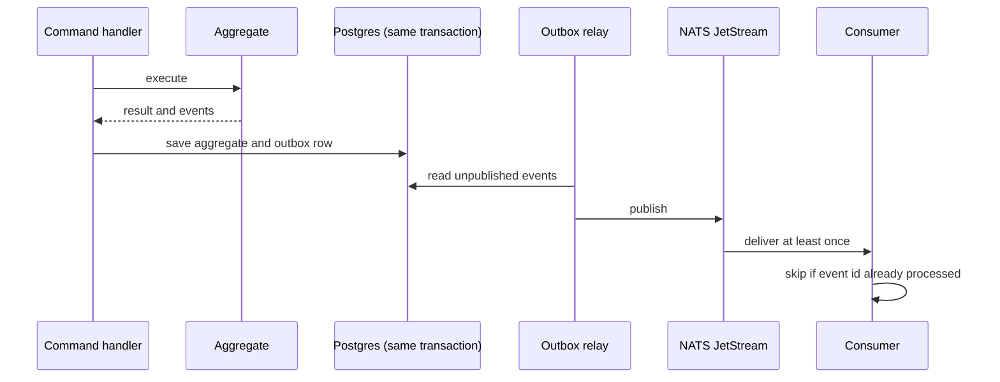
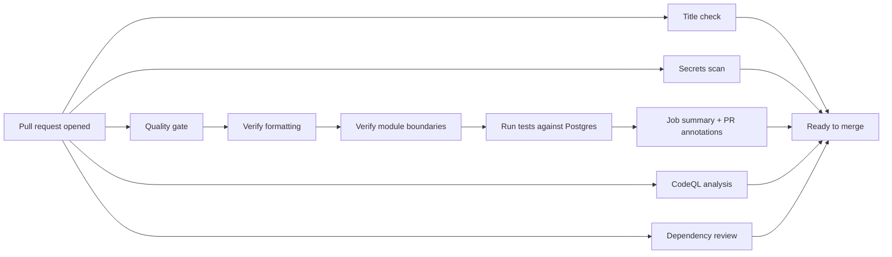

# Frappé API

Frappé is the operating system for a restaurant business day, built for restaurant chains with more than one branch. From opening the day's books to seating a guest, firing a course, printing a bill, taking a payment, closing the drawer and restocking the kitchen: one system that every branch and every role reads from and writes to, so nothing depends on one person's memory or presence.

This repository hosts the backend API.

## The problem

A multi-branch chain often runs on paper habits wearing a digital coat: a booking written on a pad, a bill split by hand, a stock count that lives in someone's head, a manager who is the only person who can open a settings screen. When the owner is not in the building, the business slows down or breaks a rule nobody wrote down.

Frappé is built around two ideas:

- **The branch is where things happen.** A business is the tenant and the legal entity, but every trading day, bill and shift belongs to a branch, with its own clock, currency and floor.
- **Facts are frozen when they become true.** A tab freezes its business date, guest count and payment terms when it opens; a fired course freezes its prep estimate and destination when it is dispatched. A report from a year ago still explains itself.

## Who it is for

| Stakeholder | What Frappé gives them |
| --- | --- |
| Owner | Register a business, open branches, hire staff and see every branch's numbers without being in the building. |
| Manager | Run a branch day to day: opening hours, staff, and closing the trading day so its numbers stop moving. |
| Accountant | Access to the books of every business they keep, and nothing else. |
| Host, waiter, cashier | Fast tools for a phone in one hand and a tray in the other: bookings, tabs, blind cash counts. |
| Kitchen | Each fired course becomes the right tasks at the right stations, once. |
| Buyer | Suppliers, what they sell, and a purchasing flow that keeps stock and cost honest. |
| Guest | A menu in their language, a bill that adds up when split, confirmations in the restaurant's own voice. |

Users are global: one person can own or work for several businesses with a single identity.

## Roadmap to v1

| Phase | Modules | At the end of this phase a chain can… |
| --- | --- | --- |
| 0 | platform (as needed) | Nothing visible yet: tooling, shared kernel, outbox and NATS relay, row-level security. |
| 1 | identity, organization, geo, access | Register, create the chain and open its first branch. |
| 2 | staff, floor (plan) | Hire staff, assign roles per branch, sign in on terminals with a PIN, lay out tables. |
| 3 | media, catalog, pricing, menu | Build products, price them per branch and publish a menu. |
| 4 | floor (service), order | Seat guests, open tabs and take orders. |
| 5 | kitchen, printing, billing, payment | Send orders to the kitchen, produce the bill and take payment. First sellable product. |
| 6 | cashbox, billing (receipts), reservation | Close the business day and the cash drawer, issue receipts, take reservations with deposits. |
| 7 | inventory, recipe, procurement, customer, loyalty, notification | Control stock and costs, buy from suppliers, know, reward and message guests. |
| 8 | subscription, analytics, diner, conversation, assistant | Pay Frappé, understand the business with metrics, give guests an account, talk to them with an assistant. |

## Architecture

A Java modular monolith on Spring Boot and Spring Modulith: one deployable application split into modules whose boundaries are verified on every build.

- **Module anatomy.** The module root package is its public surface (an `XxxApi` interface and published events). Everything below it (`domain`, `application`, `infrastructure`) is internal.
- **Pure domain.** Aggregates, value objects and events have no Spring or JPA dependencies. Use cases run through a command/query bus.
- **Communication.** Modules talk through domain events; a public `Api` is used only for unavoidable synchronous reads. No module touches another's tables.
- **Events.** Every event is written to a Postgres outbox in the same transaction as the aggregate, then relayed to NATS JetStream. Delivery is at-least-once and consumers are idempotent.
- **Tenancy.** Shared tables with `tenant_id`, isolated by Postgres row-level security.
- **Auth.** In-house, with opaque server-side sessions (person, terminal with PIN operator, guest), instantly revocable. Role-based access control per branch.



## Tech stack

Java 25 · Spring Boot 4.1 · Spring Modulith 2.1 · Gradle (Kotlin DSL) · PostgreSQL 18 + Flyway · NATS JetStream · Testcontainers · Spotless + Palantir Java Format · gitleaks · GitHub Actions · OpenTelemetry

## Getting started

### Prerequisites

- Java 25 (Temurin recommended). The Gradle toolchain can also provision it automatically.
- Docker, for local infrastructure and Testcontainers-based tests.
- [gitleaks](https://github.com/gitleaks/gitleaks), for the pre-commit hook.

### Local infrastructure

Start Postgres and NATS (JetStream enabled):

```bash
docker compose up -d
```

Spring Boot's Docker Compose support also starts these services when the application runs locally.

### Build and test

Run the full quality gate (formatting check, module boundary verification, tests):

```bash
./gradlew check
```

Fix formatting with `./gradlew spotlessApply`.

### Git hooks

A versioned pre-commit hook runs gitleaks against staged changes. Enable it once per clone:

```bash
git config core.hooksPath .githooks
```

## Continuous integration

Every pull request tells the story of what was verified before it can merge. A history-aware secrets scan runs first, independently of the rest. In parallel, the quality gate checks out the branch, verifies formatting, verifies module boundaries and finally runs the test suite against a real Postgres instance, in that order, annotating the pull request with the test results and publishing a summary with the outcome of each stage and the generated Modulith component diagram. Separately, CodeQL and a dependency review look for known and structural vulnerabilities, and a title check enforces Conventional Commits before merge. Dependabot keeps Gradle, GitHub Actions and Docker dependencies current on a weekly schedule.



## Documentation

Product documentation, architecture decisions and tickets live in Plane.

## License

Proprietary. Copyright (c) 2026 Frappé. All rights reserved. See [LICENSE](LICENSE). This repository is public until v1 for transparency only; no usage rights are granted.
