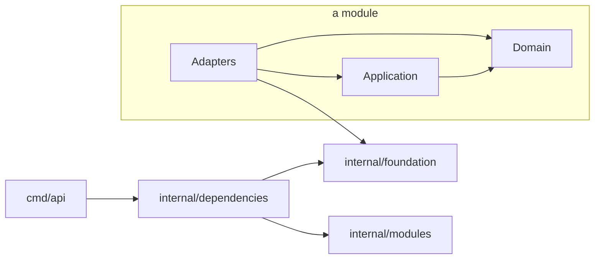

# Frappé API

Backend API of the frappe platform for restaurants, cafes and food businesses across LATAM. Go, hexagonal architecture, Postgres with Row Level Security, and OpenTelemetry from day one.

> Proprietary software of Nülled Software. See [LICENSE](LICENSE). No use, copy or distribution without written permission.

## Quick start

Requirements: Go (version in `go.mod`), [Task](https://taskfile.dev), Docker (Docker Desktop, OrbStack or Colima).

```bash
cp .env.example .env   # local defaults, loaded by every task
task local:up          # services, migrations and the API with hot reload
```

`task local:up` starts Postgres, Valkey, NATS and Grafana LGTM, waits until they are healthy, applies migrations and runs the API on http://localhost:8080 with hot reload (air). Saving a `.go` or `.sql` file rebuilds and restarts it gracefully.

Verify:

```bash
curl -i http://localhost:8080/health/ready   # 200 application/health+json
open http://localhost:8080/docs               # OpenAPI docs (development only)
open http://localhost:3000                    # Grafana: logs, traces, metrics
```

Stop:

| Action | Effect |
|--------|--------|
| Ctrl+C | Stops the API; services keep running for a fast next start |
| `task local:down` | Stops every service, keeps data |
| `task local:reset` | Stops every service and deletes local data (asks first) |

## Everyday commands

Tasks follow `<domain>:<action>`. Run `task` to list them all.

| Goal | Command |
|------|---------|
| Everything local, hot reload | `task local:up` / `task local:down` |
| API only, hot reload | `task application:watch` |
| API only, no reload | `task application:run` |
| Run with Infisical secrets | `task secrets:run` |
| Full local check (same as CI) | `task ci:run` |
| Unit tests | `task test:unit` |
| Integration tests (Docker) | `task test:integration` |
| Lint / auto-fix | `task lint:run` / `task lint:fix` |
| Architecture rules | `task architecture:check` |
| New migration | `task migrations:create -- <name>` |
| Migration status / rollback | `task migrations:status` / `task migrations:rollback` |
| Vulnerability scan | `task security:vuln` |

## Architecture

Screaming, hexagonal architecture. Infrastructure and business never share a root.

```
cmd/
  api/                  API entrypoint
  migrate/              migration runner (separate binary, same image)
internal/
  foundation/           what makes the application run, zero business
    application/        lifecycle: hooks, Up/Down, readiness
    cache/              read-through cache: Store port, memory and valkey adapters, event invalidation
    configuration/      configuration and validation (environment provider)
    database/           pgx pool, RLS-ready transactions
    events/             broker-agnostic events: CloudEvents envelope, ports, typed consumers
      outbox/           storage-agnostic transactional outbox and relay
        postgres/       Postgres outbox store (LISTEN/NOTIFY wake-ups)
      memory/           in-memory broker (tests, running without a broker)
    health/             background dependency checks
    httpserver/         HTTP server, middleware, Huma /v1 API
    logging/            JSON logs to stdout, level gating
    nats/               NATS JetStream event broker adapter
    ratelimit/          GCRA rate limiter on Valkey
    telemetry/          OpenTelemetry traces, metrics, logs
    valkey/             Valkey client
  modules/              business modules (one folder per module)
    <module>/
      domain/           entities and rules, no infrastructure
      application/      use cases and the ports they need
      adapters/         http, postgres, ...
      events/           published events: the only package other modules may import
      metrics/          module metrics
      tracing/          module spans
      module.go         module wiring
  dependencies/         composition root: builds dependencies, injects modules
migrations/             SQL migrations (goose, timestamp-versioned, embedded)
deployments/            local infrastructure (database init script)
```



Rules enforced in CI by `go-arch-lint` and `depguard`:

- `domain` imports nothing from infrastructure (no HTTP, database, JSON or OpenTelemetry).
- `application` depends only on its own `domain`; it never touches the database or `pgx`.
- `foundation` never imports `modules` or `dependencies`.
- A module never imports another module's internals; `modules/<module>/events` is the only package other modules' application, adapters and module root may import, and it depends on `foundation/events` only. `domain` never imports events.
- Only `foundation/nats` and `dependencies` may import the NATS client; everything else uses the broker-agnostic ports.
- Modules never read the global configuration: each module declares its own `Configuration` and `Dependencies` and receives them by constructor.

## Key concepts

| Concept | How it works |
|---------|--------------|
| Lifecycle | Every dependency declares `Up`, `Down` and optionally `Check`. Up runs in order, Down in reverse, failures roll back what already started. |
| Readiness | `/health/live` never checks dependencies. `/health/ready` is 503 until every `Up` finished and every declared check passes; it flips to 503 first on shutdown, then the server drains. |
| Row Level Security | Tenant settings are applied per transaction with `set_config(..., true)`, never per session. The application role cannot bypass RLS; tables use `FORCE ROW LEVEL SECURITY`. |
| Database roles | `frappe_migration` owns the schema and runs migrations; `frappe_application` is the runtime role (RLS-bound; on `outbox` it may only `INSERT`; on `inbox` only `INSERT`, `DELETE` and `SELECT (processed_at)`); `frappe_outbox_relay` is the outbox relay's role (`SELECT`, `UPDATE`, `DELETE` on `outbox` only, across tenants). All three are created outside migrations (`deployments/database/initialize.sql` locally). |
| Migrations | Run by `cmd/migrate` as a deploy step, never at API startup. Timestamp-versioned, out-of-order allowed. |
| Cache | Infrastructure only: a module adapter decorates its read port with `cache.New(backend, "<module>.<entry>", lifetime, next.Find)` and calls `Get`; use cases and domain never see it. Keys are `frappe:<tenant:<id>|global>:<name>:v<version>:<key>`, tenant from context (no tenant, no caching), escaped keys, singleflight, fails open, no negative caching, jitter, event-driven invalidation. See `internal/foundation/cache/doc.go`. |
| Rate limiting | GCRA in Valkey, IETF `RateLimit-*` headers, 429 as RFC 9457. Fails open if Valkey is unavailable. |
| Internationalization | `I18N_SUPPORTED_LOCALES` (default `es-419,en,pt-BR,fr,it,de,ru,zh-Hans,ko,ja`) and `I18N_SOURCE_LOCALE` (default `es-419`) are BCP 47 tags validated at startup; each needs an embedded catalog. Every `/v1` request negotiates `Accept-Language` (es-AR matches es-419, pt matches pt-BR, no match falls back to the source) and gets `Content-Language` and `Vary: Accept-Language`. Static messages live in `internal/foundation/i18n/locales/<tag>.json`; translate with `i18n.T(ctx, "key")` or `i18n.TranslateWith(ctx, "key", i18n.Data{"Count": n})`, falling back requested locale, source, key. A test fails when a catalog misses a source key. See `internal/foundation/i18n/doc.go`. |
| CORS | Disabled unless `HTTP_CORS_ALLOWED_ORIGINS` lists exact origins. Preflights are answered with 204 before rate limiting and routing; `*` with credentials is rejected at startup. |
| Event broker | `EVENTS_BROKER` selects `none` (default), `memory` (single process) or `nats` (JetStream stream `FRAPPE_EVENTS`, dedup on event ID, durable pull consumers, dead letters in `FRAPPE_EVENTS_DEAD_LETTER`). Only `internal/foundation/nats` and `internal/dependencies` may import the NATS client. |
| HTTP caching | Every `/v1` response is `Cache-Control: no-store` unless the handler declares a policy (`httpserver.Private`, `Revalidate`, `Public`, `NoStore`) with an ETag through `httpserver.NotModified`, which answers matching `If-None-Match` GET/HEAD requests with 304 before the body is computed. Private and Revalidate add `Vary: Authorization`; Public is only for non-tenant data. See `internal/foundation/httpserver/doc.go`. |
| Errors | RFC 9457 `application/problem+json`. |
| Events | CloudEvents 1.0 JSON, type `frappe.<module>.<event>.v<version>`, defined with `events.Define`. Use cases `Record` into a transactional outbox (storage-agnostic `outbox.Store`); a relay publishes to any broker behind `events.Publisher`. Delivery is at-least-once; the consumer runtime deduplicates every handler registered with `events.On` through the inbox, so handlers are exactly-once in effect. Failures retry with backoff, then dead letter. `partitionkey` and `sequence` extensions order events per entity. See `internal/foundation/events/doc.go`. |
| Telemetry | OTLP to any collector (local otel-lgtm or Grafana Cloud). Parent-based trace sampling: 100% in development, 10% in production. |

## Configuration

All configuration comes from environment variables, validated at startup: invalid or missing values stop the application with a message naming the variable. [`.env.example`](.env.example) lists every variable with its default.

Secrets are never committed. Locally, `task secrets:run` injects them with the Infisical CLI; in deployed environments the orchestrator injects them as environment variables.

### Events: define, record, relay, consume

1. **Define** an event in the module's published `events` package: `var OrderPlaced = events.Define[OrderPlacedData]("orders.placed", 1)` (type `frappe.orders.placed.v1`).
2. **Record** it in the use case, inside the transaction that changes state: `recorder.Record(ctx, OrderPlaced.With(data))` within `database.WithinTransaction`. The event lands in the `outbox` table if and only if the business change commits (`Append` fails outside a transaction), and carries the caller's trace context.
3. **Relay.** With `OUTBOX_ENABLED=true`, the relay claims pending rows with `FOR UPDATE SKIP LOCKED` (safe on many replicas), publishes them to the broker selected by `EVENTS_BROKER` (wired automatically; `OUTBOX_ENABLED` with `EVENTS_BROKER=none` is a configuration error) and marks them published. It is woken by `LISTEN outbox`, with polling as a fallback. Leases and retry times use the database clock. A crash between publish and mark republishes the event with the same ID.
4. **Consume.** A module registers handlers in its `Subscriptions(registry)` with `events.On(registry.Module("billing"), orders.OrderPlaced, handler)`; the composition root builds the registry. When `EVENTS_BROKER` is not `none`, the consumer runtime subscribes every registration at startup and stops them (waiting for in-flight handlers) at shutdown.
5. **Inbox.** Each delivery runs through `inbox.Store.Process(consumer, event ID)`: one transaction inserts `(consumer, event_id)` into `inbox` with `ON CONFLICT DO NOTHING` and runs the handler with a ctx carrying that transaction, so the handler's writes (through `database.WithinTransaction`, nested with tenant settings when needed, or `database.TransactionFromContext`) commit atomically with the record. An already recorded event is skipped and counted in `frappe.events.duplicates{consumer,type}`; a failed handler records nothing and is retried. Records older than `INBOX_RETENTION` are purged by the runtime.

Neither `outbox` nor `inbox` has RLS: they hold no data readable through the API, and privileges isolate them instead (`frappe_application` may only `INSERT` into `outbox`; on `inbox` it may `INSERT`, `DELETE` and read `processed_at` for the purge, never which events were processed).

Locally, `compose.yaml` runs the whole flow: `EVENTS_BROKER=nats`, `OUTBOX_ENABLED=true` and `DATABASE_OUTBOX_RELAY_URL` for the development `frappe_outbox_relay` role. The end-to-end proof is `TestIntegrationEventFlowIsAtomicTracedAndExactlyOnce` in `internal/dependencies`.

| Variable | Default | Meaning |
|----------|---------|---------|
| `EVENTS_BROKER` | `none` | `none`, `memory` or `nats`. Anything but `none` also runs the consumer runtime. |
| `OUTBOX_ENABLED` | `false` | Runs the relay. Requires `EVENTS_BROKER` other than `none` and `DATABASE_OUTBOX_RELAY_URL`. Recorded events are kept while it is off. |
| `DATABASE_OUTBOX_RELAY_URL` | | Connection string for `frappe_outbox_relay`. Secret. |
| `OUTBOX_BATCH_SIZE` | `100` | Messages claimed at once. |
| `OUTBOX_POLL_INTERVAL` | `1s` | Poll when no notification arrives. |
| `OUTBOX_LEASE` | `30s` | Claim lease; must exceed the time to publish a batch. |
| `OUTBOX_PURGE_INTERVAL` / `OUTBOX_RETENTION` | `1h` / `72h` | How often and after how long published rows are deleted. |
| `OUTBOX_BASE_BACKOFF` / `OUTBOX_MAX_BACKOFF` | `1s` / `5m` | Exponential retry delay bounds. |
| `INBOX_PURGE_INTERVAL` / `INBOX_RETENTION` | `1h` / `168h` | How often and after how long inbox records are deleted. Retention must outlive every redelivery (it matches `NATS_STREAM_MAX_AGE`), or a late duplicate is handled again. |

### Cache: decorate a read port

```go
// adapters: the use case keeps depending on application.Menus
type CachedMenus struct {
    application.Menus
    byID *cache.ReadThrough[uuid.UUID, domain.Menu]
}

func NewCachedMenus(backend *cache.Backend, next application.Menus) *CachedMenus {
    return &CachedMenus{Menus: next, byID: cache.New(backend, "menu.by_id", 5*time.Minute, next.FindByID)}
}

func (menus *CachedMenus) FindByID(ctx context.Context, id uuid.UUID) (domain.Menu, error) {
    return menus.byID.Get(ctx, id)
}

// module root: drop entries when menu.updated is consumed
eventinvalidation.On(registry, menuevents.Updated, byID,
    func(event events.Event[menuevents.MenuUpdated]) (string, []uuid.UUID) {
        return event.Data.Tenant, []uuid.UUID{event.Data.MenuID}
    })
```

Options: `cache.Global()` (not tenant-owned), `cache.Version(n)` (bump when the cached type changes; old entries are orphaned), `cache.Codec(c)`, `cache.Jitter(fraction)`. `InvalidateFor(ctx, tenant, keys...)` is the only explicit-tenant call, for event consumers. Metrics: `frappe.cache.requests{module,outcome}`, `frappe.cache.load.duration{module}`, `frappe.cache.errors{operation,reason}`.

| Variable | Default | Meaning |
| --- | --- | --- |
| `CACHE_ENABLED` | `false` | Off: every entry loads from the source. |
| `CACHE_STORE` | `memory` | `memory` or `valkey` (shares the rate limiter's client; requires `VALKEY_ADDRESS`). |
| `CACHE_DEFAULT_TIME_TO_LIVE` | `5m` | Lifetime of entries created with a zero lifetime. |
| `CACHE_OPERATION_TIMEOUT` | `100ms` | Max latency an unhealthy store adds before a read fails open. |

## Testing

- Unit tests run without external services: `task test:unit`.
- Integration tests use the `integration` build tag and testcontainers. `databasetest.New(t)` returns an isolated, migrated database cloned from a template in milliseconds, safe with `t.Parallel()`.
- With Colima, point testcontainers at its socket:

```bash
export DOCKER_HOST="unix://$HOME/.colima/default/docker.sock"
export TESTCONTAINERS_DOCKER_SOCKET_OVERRIDE=/var/run/docker.sock
```

## Contributing

| Item | Convention |
|------|------------|
| Branches | `<type>/<short-description>`, e.g. `feat/cancel-orders` |
| Commits and PR titles | [Conventional Commits](https://www.conventionalcommits.org) |
| Merging | Squash merge only; branches are deleted after merge |
| PR description | Follow the template in `.github/pull_request_template.md` |
| Naming | Full words, no abbreviations (`configuration`, not `config`) |
| Text | English, plain ASCII, no emojis, no AI attribution |
| Tests | Test-driven development; tests ship with the behavior |

Every PR must pass: lint and format, `go mod tidy`, unit tests, integration tests, vulnerability scan, architecture rules, and PR conventions. Labels and assignee are applied automatically.

## License

Proprietary. Copyright (c) 2026 Nülled Software. All rights reserved. See [LICENSE](LICENSE).
